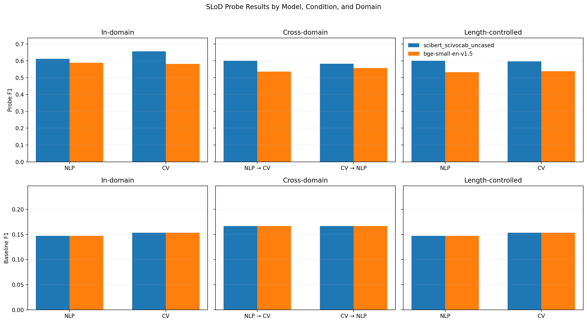

# SLoD Probe Report

## Abstract

Frozen embeddings linearly separate macro-, meso-, and micro-level scientific text well above a majority baseline. On the current weak-label dataset, SciBERT is strongest overall, cross-domain transfer remains above baseline, and length control lowers performance but does not erase the signal. The main caveat is interpretive: these are structural weak labels, so the result supports decodability of SLoD-related cues rather than a strong claim about a clean internal abstraction hierarchy.

## 1. Method

- Weak labels are generated from prepared S2ORC shards in [`src/dataset.py`](../src/dataset.py).
- The labeling rules now match the assignment definition:
  - `macro`: title, abstract, first two introduction paragraphs, conclusion
  - `meso`: first sentence of each real non-intro, non-conclusion section
  - `micro`: non-lead paragraphs from methods-, experiments-, and results-like sections
- Two frozen encoders are evaluated in [`src/embed.py`](../src/embed.py):
  - `allenai/scibert_scivocab_uncased`
  - `BAAI/bge-small-en-v1.5`
- The probe is a linear classifier with paper-level splits in [`src/probe.py`](../src/probe.py).
- Evaluation covers all required conditions: in-domain, cross-domain, and length-controlled in-domain.

### 1.1 Dataset Shape

The regenerated span files are larger than the assignment minimum and exactly class-balanced within each domain.

| domain | papers | spans | per-label count |
| --- | ---: | ---: | ---: |
| NLP | 153 | 2,805 | 935 each |
| CV | 153 | 3,246 | 1,082 each |

Overall, the dataset contains 6,051 spans across 306 papers, with 2,017 examples per class. That comfortably exceeds the assignment target of at least 500 spans per class across at least 50 papers.

## 2. Results

The full metrics are saved in [`results/probe_results.json`](../results/probe_results.json). Majority baselines remain low, with macro F1 between 0.147 and 0.167 for the full in-domain and cross-domain settings.

*Figure 1. Macro F1 summary across all required evaluation settings. This is the highest-information figure in the report because it shows the model comparison, transfer gap, and length-control effect at once.*

| model | condition | train -> test | macro F1 | accuracy |
| --- | --- | --- | ---: | ---: |
| SciBERT | in_domain | NLP -> NLP | 0.612 | 0.613 |
| SciBERT | in_domain | CV -> CV | 0.656 | 0.658 |
| SciBERT | cross_domain | NLP -> CV | 0.600 | 0.598 |
| SciBERT | cross_domain | CV -> NLP | 0.582 | 0.582 |
| SciBERT | controlled | NLP -> NLP | 0.601 | 0.602 |
| SciBERT | controlled | CV -> CV | 0.597 | 0.597 |
| BGE-small | in_domain | NLP -> NLP | 0.589 | 0.591 |
| BGE-small | in_domain | CV -> CV | 0.582 | 0.585 |
| BGE-small | cross_domain | NLP -> CV | 0.536 | 0.536 |
| BGE-small | cross_domain | CV -> NLP | 0.557 | 0.558 |
| BGE-small | controlled | NLP -> NLP | 0.533 | 0.536 |
| BGE-small | controlled | CV -> CV | 0.538 | 0.540 |

Three patterns matter most.

1. SciBERT is strongest on every condition. The gain is clearest on CV in-domain testing, where SciBERT reaches 0.656 macro F1 versus 0.582 for BGE-small. That pattern is plausible because SciBERT was pretrained for scientific language, so it is more likely to preserve discourse and genre cues that align with section-level abstraction. BGE-small is still competitive, but its weaker controlled and cross-domain performance suggests that the SLoD signal is exposed less cleanly in its embedding space.

2. cross-domain transfer is weaker than in-domain performance but still clearly above the majority baseline. That means some SLoD signal generalizes across NLP and CV, but the embedding spaces still retain domain-sensitive structure. The drop is modest rather than catastrophic, which argues against the probe relying only on narrow topic vocabulary from one field.

3. the length-controlled condition lowers scores, but not catastrophically. SciBERT drops from 0.612 to 0.601 on NLP and from 0.656 to 0.597 on CV. BGE-small drops more clearly, from 0.589 to 0.533 on NLP and from 0.582 to 0.538 on CV. The result is that length matters, but it does not fully explain probe success. The stronger degradation on CV also suggests that some of the CV signal is tied more closely to stylistic regularities such as paragraph length and layout conventions.

### 2.1 Per-Class Precision and Recall

Ordered `macro`, `meso`, `micro`. Values are `precision / recall`.

| model | condition | train -> test | macro | meso | micro |
| --- | --- | --- | --- | --- | --- |
| SciBERT | in_domain | NLP -> NLP | 0.667 / 0.654 | 0.530 / 0.611 | 0.642 / 0.579 |
| SciBERT | in_domain | CV -> CV | 0.758 / 0.689 | 0.626 / 0.662 | 0.592 / 0.616 |
| SciBERT | cross_domain | NLP -> CV | 0.726 / 0.655 | 0.566 / 0.536 | 0.524 / 0.603 |
| SciBERT | cross_domain | CV -> NLP | 0.684 / 0.679 | 0.529 / 0.530 | 0.535 / 0.537 |
| SciBERT | controlled | NLP -> NLP | 0.696 / 0.649 | 0.508 / 0.571 | 0.604 / 0.583 |
| SciBERT | controlled | CV -> CV | 0.722 / 0.622 | 0.592 / 0.575 | 0.495 / 0.593 |
| BGE-small | in_domain | NLP -> NLP | 0.660 / 0.635 | 0.476 / 0.566 | 0.638 / 0.570 |
| BGE-small | in_domain | CV -> CV | 0.660 / 0.660 | 0.574 / 0.560 | 0.511 / 0.525 |
| BGE-small | cross_domain | NLP -> CV | 0.610 / 0.583 | 0.511 / 0.496 | 0.492 / 0.528 |
| BGE-small | cross_domain | CV -> NLP | 0.600 / 0.630 | 0.520 / 0.547 | 0.552 / 0.496 |
| BGE-small | controlled | NLP -> NLP | 0.581 / 0.519 | 0.443 / 0.514 | 0.581 / 0.566 |
| BGE-small | controlled | CV -> CV | 0.601 / 0.555 | 0.526 / 0.546 | 0.492 / 0.514 |

The most persistent pattern is that `meso` remains the hardest class. That makes sense: section leads sit between the globally summary-like `macro` spans and the clearly procedural `micro` spans, so they are the most structurally ambiguous category.

### 2.2 Confusion Matrices

Ordered `macro`, `meso`, `micro`. To keep the report compact, the main text shows the confusion matrices for the strongest model, SciBERT; the full result set for both models remains in [`results/probe_results.json`](../results/probe_results.json).

- SciBERT in-domain NLP -> NLP: `[[136, 36, 36], [28, 107, 40], [40, 59, 136]]`
- SciBERT in-domain CV -> CV: `[[144, 33, 32], [27, 137, 43], [19, 49, 109]]`
- SciBERT cross-domain NLP -> CV: `[[709, 133, 240], [149, 580, 353], [119, 311, 652]]`
- SciBERT cross-domain CV -> NLP: `[[635, 163, 137], [139, 496, 300], [154, 279, 502]]`
- SciBERT controlled NLP -> NLP: `[[135, 32, 41], [26, 100, 49], [33, 65, 137]]`
- SciBERT controlled CV -> CV: `[[130, 35, 44], [25, 119, 63], [25, 47, 105]]`

## 3. Error Analysis

The examples below come from the current SciBERT in-domain NLP split.

| class | correct examples | failure examples |
| --- | --- | --- |
| macro | `827948 / title / "Knowledge-Guided Linguistic Rewrites for Inference Rule Verification"`; `2091259 / abstract / "This paper describes our preliminary attempt..."`; `8269086 / title / "LEXSEMTM: A Semantic Dataset..."` | `15983238 / Conclusion / "In such a representatlon framework..." -> meso`; `15983238 / Conclusion / "Our goal m thls work..." -> meso`; `15983238 / Conclusion / "To tackle reference problems..." -> meso` |
| meso | `2091259 / Identification / "Our primary goal is to identify relevant information..."`; `2091259 / Results / "We classified our 320 '(A no) B' examples..."`; `2091259 / Yamura / "As our centering analysis above indicates..."` | `258352741 / Translation Error Reduction with Context / "Finally, we analyze the extent..." -> micro`; `259367730 / Dataset # P # T L SD / "Alzheimer's Dementia Recognition..." -> macro`; `259858804 / ( 9 ) / "Mary [MASK] John the ball..." -> micro` |
| micro | `827948 / Experiments / "Comparison of PPDB e and VPPDB e..."`; `8269086 / Evaluation / "In addition, we compared the time taken..."`; `14984743 / Experimental Set-up / "In a typical application..."` | `8269086 / Evaluation of LEXSEMTM / "We can contrast this result..." -> macro`; `15983238 / Determine which relaxation methods to apply / "Complex relatlons speclfted..." -> meso`; `26237045 / Evaluation protocol / "For the whole system evaluation..." -> meso` |

Two failure modes are especially common.

1. conclusion paragraphs sometimes read like section leads rather than global summaries, so `macro` can drift into `meso`.
2. detailed evaluation prose often mixes local results with broader interpretation, which makes `micro` and `meso` hard to separate. These are plausible semantic ambiguities rather than obvious label noise alone.

There is also a smaller class of failures driven by weak-label roughness. Some section headers are unusual, formula-like, or dataset-specific, and those make the section-role heuristic less reliable. In those cases, the probe may be wrong, but the label itself is not fully clean either.

Overall, the error profile looks more like a boundary problem than a collapse problem. The system usually distinguishes high-level, lead-sentence, and detail-heavy text, but it struggles when a span mixes two discourse functions at once. That is exactly the kind of error pattern you would expect if the embeddings contain a real but imperfect SLoD signal.

## 4. Conclusion

The current experiments support a cautious positive answer to the assignment question: frozen embeddings do encode enough information for a linear probe to recover SLoD labels well above baseline. The evidence is strongest for SciBERT, consistent across in-domain and cross-domain testing, and still present after fixed-length control.

The main limitation is still epistemic rather than engineering-related. Because the labels come from paper structure, this is a probe of SLoD-related cues under weak supervision, not a proof that the model contains a clean, explicit hierarchy of abstraction (Belinkov, 2022). The most defensible claim is therefore decodability, with length and section-style confounds reduced but not fully eliminated.

Future refinements could benefit from the more specialized methods identified in the literature review. For labeling, the Snorkel framework (Ratner et al., 2017) offers a more formal way to model the noise in our structural heuristics by combining multiple labeling functions into probabilistic targets. On the representation side, the use of hyperbolic geometry (Nickel & Kiela, 2017) could provide a more natural inductive bias for the nested, tree-like structure of scientific discourse than the standard Euclidean embeddings used here. These approaches would help transition the study from demonstrating simple decodability to mapping the specific geometric and probabilistic properties of the SLoD signal.

## 5. References

- Belinkov, Y. (2022). *Probing Classifiers: Promises, Shortcomings, and Advances*.
- Nickel, M., & Kiela, D. (2017). *Poincaré Embeddings for Learning Hierarchical Representations*.
- Ratner, A., Bach, S. H., Ehrenberg, H., Fries, J., Wu, S., & Ré, C. (2017). *Snorkel: Rapid Training Data Creation with Weak Supervision*.
